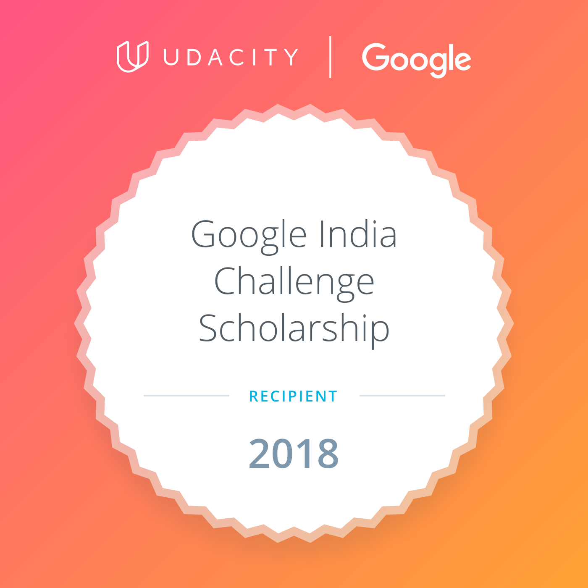
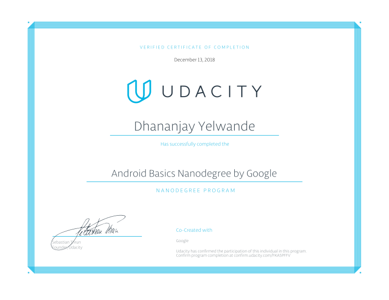

  

<h2 align="center"> Android Basics By Google </h2>

> This Nanodegree program was given to me by the **"Google India Scholarship Challenge"** program from Udacity.
I completed this course in due time. It was thanks to my prior knowledge of developing and programming.
Now, i've become a mobile developer for Android.
These skills are precious to me.

---

<a href="https://www.udacity.com/course/android-basics-nanodegree-by-google--nd803">Click to view this nanodegree on Udacity</a>

  

### Projects:

Project 1 - Build a Single Screen App

Project 2 - Score Keeper App

Project 3 - Quiz App

Project 4 - Musical Structure App

Project 5 - Report Card App

Project 6 - Tour Guide App

Project 7 - Book Listing App

Project 8 - News App

Project 9 - Habit Tracker App

Project 10 - Inventory App
